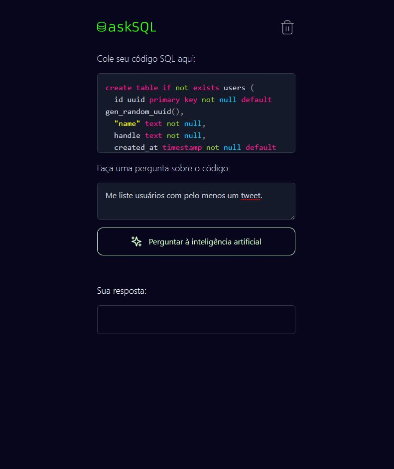

<p align="center">
  
</p>

# App de Tradução de Códigos SQL

O App de Tradução de Códigos SQL é uma aplicação inovadora que simplifica a tradução de esquemas de criação de tabelas SQL em consultas legíveis por humanos. Combinando tecnologias de ponta, como processamento de linguagem natural e frameworks web modernos, essa aplicação proporciona uma maneira intuitiva e eficiente de interagir com bancos de dados por meio de perguntas.

<p align="center">
  
</p>


## Tabela de Conteúdos

- [Funcionalidades](#funcionalidades)
- [Status do Projeto](#status-do-projeto)
- [Features](#features)
- [Tecnologias Utilizadas](#tecnologias-utilizadas)
- [Como Usar](#como-usar)
- [Contribuição](#contribuição)
- [Licença](#licença)

## Funcionalidades

- Recebe um schema de criação de tabelas SQL.
- Permite que o usuário formule perguntas com base no schema.
- Utiliza a API do OpenAI para gerar consultas SQL baseadas nas perguntas.
- Apresenta as consultas SQL geradas de forma legível.

## Status do Projeto

O projeto encontra-se em desenvolvimento ativo. A versão atual permite a interação básica com a funcionalidade principal.

## Features

- Entrada de schema de criação de tabelas SQL.
- Formulação de perguntas relacionadas ao schema.
- Tradução de perguntas em consultas SQL por meio da API do OpenAI.

## Tecnologias Utilizadas

- **Next.js**: Um framework React que facilita a construção de aplicações web modernas e eficientes.
- **Tailwind CSS**: Um framework CSS utilitário que acelera o processo de estilização e torna as interfaces responsivas.
- **react-simple-code-editor**: Um componente React para edição de código com realce de sintaxe.
- **Vercel AI SDK**: Uma biblioteca para integração eficiente com serviços de IA da Vercel, como a API do OpenAI.
- **API do OpenAI**: Utilizada para gerar consultas SQL com base nas perguntas dos usuários.

## Como Usar

1. Clone o repositório para o seu ambiente local:

```bash
git clone https://github.com/seu-usuario/RS_AskSQL.git
```

2. Instale as dependências do projeto:

```bash
npm install
```

3. Crie um arquivo `.env.local` na raiz do projeto e adicione sua chave de API do OpenAI:

```plaintext
OPENAI_API_KEY=sua-chave-de-api-aqui
```

4. Inicie o servidor de desenvolvimento:

```bash
npm run dev
```

5. Acesse a aplicação em seu navegador:

```
http://localhost:3000
```

6. Insira o schema de criação de tabelas SQL na área designada.

7. Formule uma pergunta relacionada ao esquema inserido.

8. Aguarde a resposta gerada pela API do OpenAI, contendo uma consulta SQL baseada na pergunta.

## Contribuição

Contribuições são bem-vindas! Se você encontrar algum problema ou desejar adicionar melhorias, sinta-se à vontade para abrir um pull request.

## Licença

Este projeto está licenciado sob a [Licença MIT](https://opensource.org/licenses/MIT).